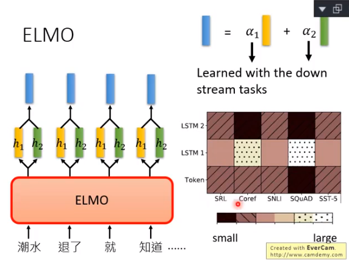
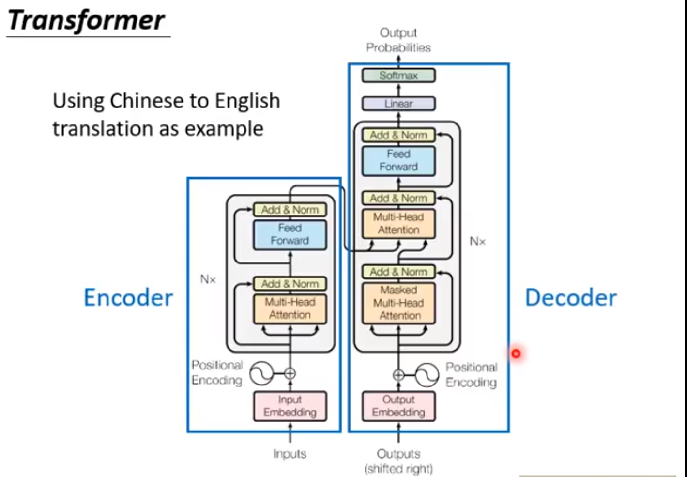
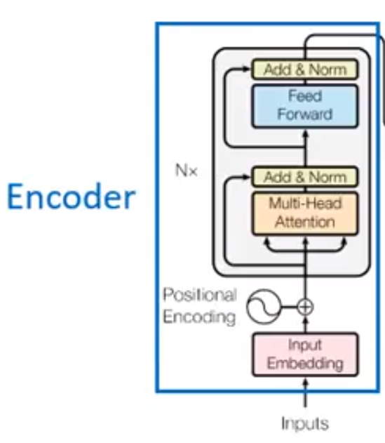
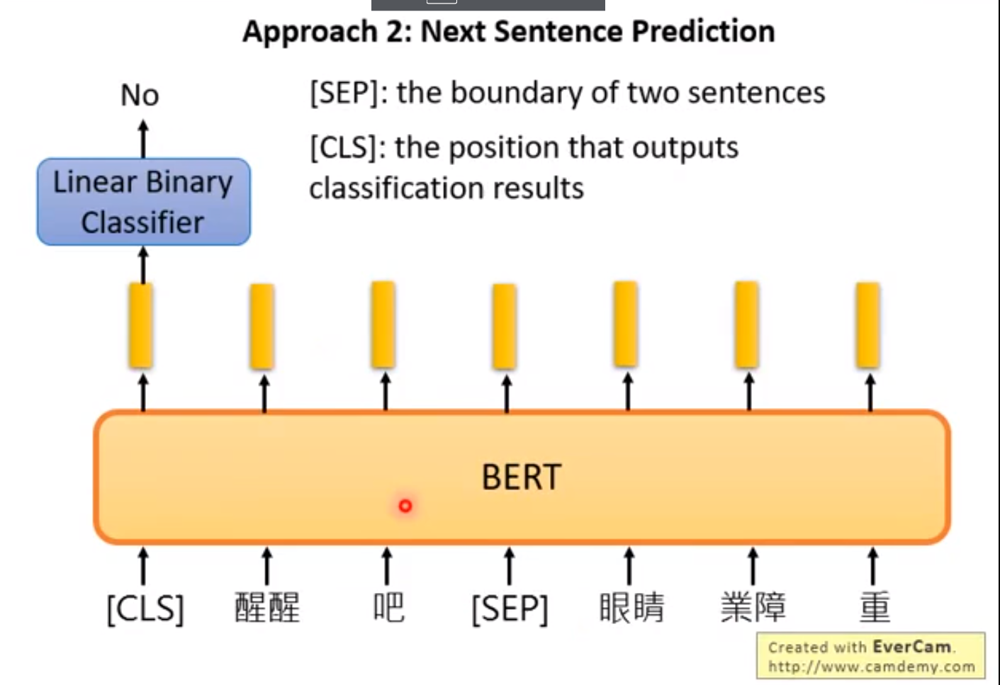
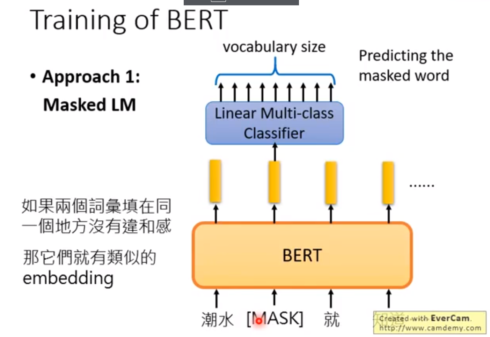
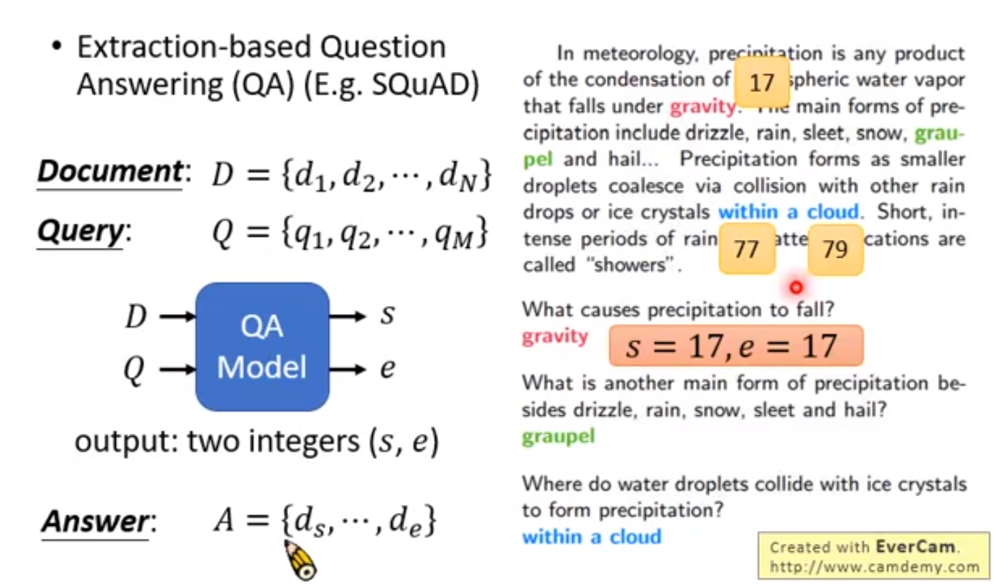
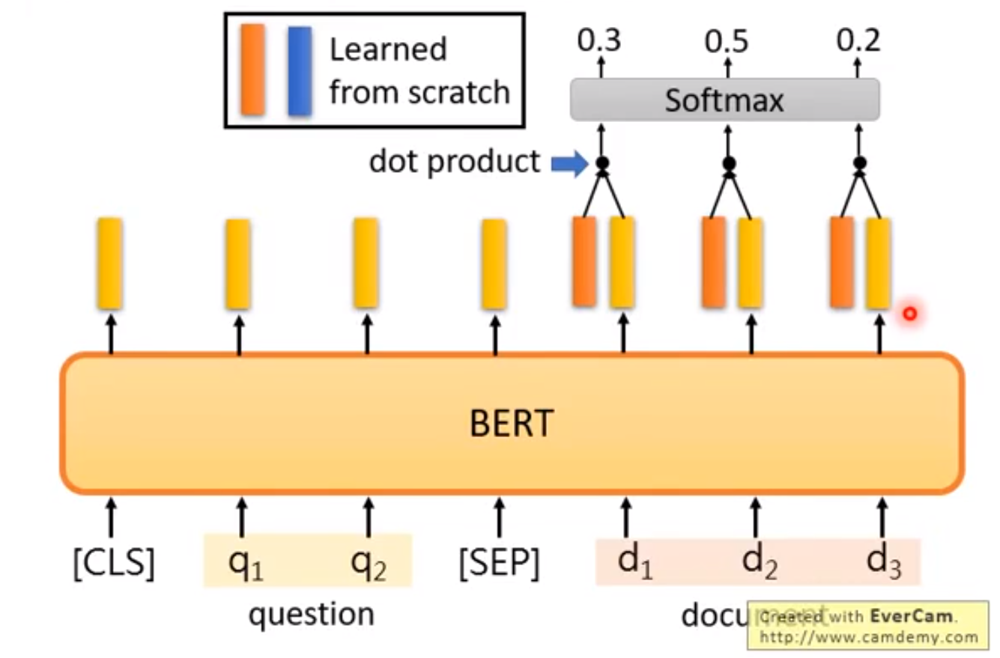
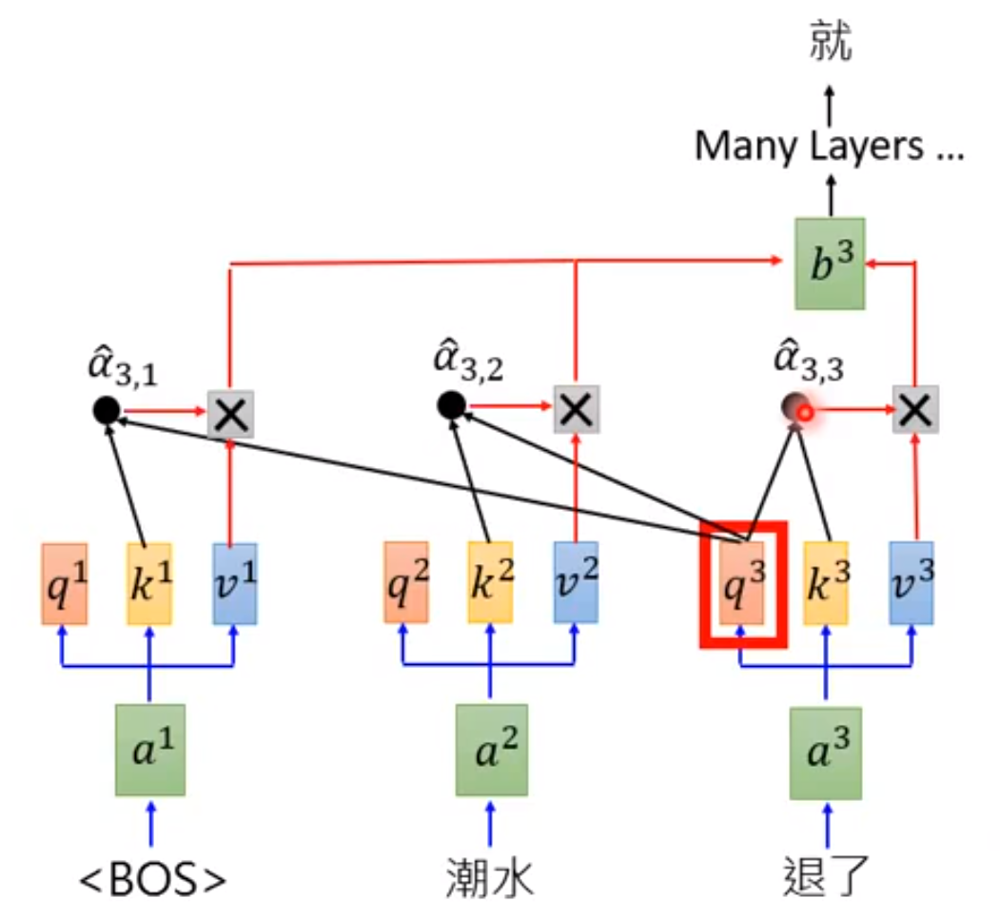

# DEEP_L_25P

## 	Putting Words into Computers

### 	1-of-N Encoding

- 每种文字各占一种编码

​		apple=[1 0 0]

​		bag=[0 1 0]

​		cat=[0 0 1]

- Word Class

  class1 dog cat bird

  class2 jump run walk

  class3 flower tree apple

- Word Embedding

  

  由向量表示词汇，相似词汇向量相似

### A word can have multiple senses

一词多义，给予该词不同含义不同的Embedding

**Contextualized Word Embedding**

#### Embeddings from Language Model(ELMO)

RNN结构，根据上文预测下一个token，逆向亦可

其深层结构如上，将每个词汇的所有embedding加权求和来确定当前使用哪种embedding，权重α为学习内容

#### Bidirectional Encoder Representations from Transformers(BERT)

**self attention**

BERT=Encoder of Transformer

输入一句话，输出该句各**字**的embedding

*review of transformer*

BERT

- 训练方法1

  输入两个句子，预测这两句是否接在一起

  [SEP]=the boundary of two sentences两句的距离

  [CLS]=the position that outputs classification results 代表分类，如二元YES\NO GOOD\BAD

  

- 训练方法2

  挖空，将输入的其中某个字masked，然后预测该mask的embedding

  

  实际训练中两种方法同时使用

  

  D代表文章有N个token，Q代表问题有M个token，输出答案在第s-e个token之间

  

  具体BERT每层(layer)学习了什么

  参考[文献](https://arxiv.org/abs/1905.05950)

#### Enhanced Representation through Knowledge Integration(ERNIE)

专为中文设计，mask时mask一个词汇而非单字

#### Generative Pre-Traning(GPT)

所需参数为BERT的5倍

GPT=Decoder of Transformer(同样为self attention)

可以做到不需要训练集即可**Zero-shot Learning**

~~一个有趣的网站，可惜下架了:(~~

[GPT2](talktotransformer.com)

