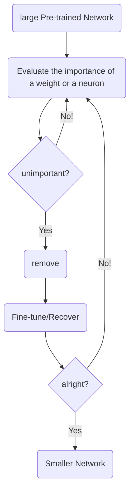

# DEEP_L_45P-50P

## Network Compression

**Resource-limited Devices**

- limited memory

- limited computing power
- etc.

### Network Pruning

 Networks are typically over-parameterized so they can be pruned

#### How

#### Why

small network is more difficult to learn successfully(overfitting...)

**Lottery Ticket Hypothesis**

使用原先(红色)的init初始化训练小网络是可行的，但是随机初始化往往是不行的。训练次数是否需要相同呢？

如果原先的init改变呢？是否会导致Pruned出的网络与之前不同？

***but...[Rethinking the Value of Network Pruning](https://arxiv.org/abs/1810.05270) gives the opposite answer***

#### Practical Issue

##### Weight pruning

实际上在修剪权重时，往往会导致网络架构的改变，这种改变看起来是简化了，实际上在计算机处理时反而并没有简化。失去了规则的结构后，往往需要进行诸多调整才能实现新的数据结构，而且这种数据结构，并不能使用GPU矩阵运算

把剔除的权重设为0以便于GPU运算，但实际上运算过程并没有简化

不过准确率还是比较可靠的

##### Neuron pruning

可行

### Knowledge Distillation

训练一个常规的Teacher Net，再训练一个Student Net，这个网络使用相同的训练集，但是它不是在真正的训练，而是尽量使自己的输出与Teacher Net相同。

在分类最后的Softmax环节，增加一个Temperature参数，使得不同结果的差异更明显，更易于Student Net学习

以T=100为例
$$
y_i=\frac{exp(x_i)}{\sum_{j}{exp(x_j)}}\rightarrow y_i=\frac{exp(x_i/T)}{\sum_{j}{exp(x_j/T)}}
$$

$$
x_1=100\quad y_1=1\rightarrow x_1/T=1\quad y_1=0.56
$$

$$
x_2=10\quad y_1=0\rightarrow x_2/T=0.1\quad y_1=0.23
$$

$$
x_3=1\quad y_3=0\rightarrow x_3/T=0.01\quad y_3=0.21
$$

### Parameter Quantization

1. Using less bits to represent a value

2. Weight clustering

   将数据分组，相近数据用相同的新数据代表，但精确度可能会降低

3. Represent frequent clusters by less bits, represent rare clusters rare clusters by more bits

   **Huffman encoding**

4. Binary Weights(like regularization)

​        why not drop out?

### Architecture Design

下层有N个neuron，上层有M个neuron。

现在这两层之中增加hidden layer K，如下图

则W矩阵和U、V矩阵对比如上，参数量减少

**Depthwise Separable Convolution**

常规情况下，图像为N个channel，滤波器也需要N个channel，所得结果channel=1

但我们现在仅使用高度为1的N个简单二维滤波器进行处理，获得的卷积结果数量为原先的N倍

但是这样你会说，得到的结果包含的信息不全面，每个结果仅包含原图像一层channel的信息

下面我们利用**Pointwise Convolution**

使用M个不同的1x1xN滤波器，即可将所有channel的信息综合起来（M为所需结果的channel数）

使用这种方法所需的参数数量较常规方法大幅减少

典型架构设计案例[MobileNet](https://arxiv.org/abs/1704.04861)

### Dynamic Computation

案例：在电量不足使，希望能动态调整算力，又不使计算结果太差

Possible Solutions

1. Train multiple classifiers

   不同网络适用不同情况，但会占用大量存储空间

2. Classifiers at the intermedia layer

   占用空间不变，但是正确率会有较大出入

   

   ​	解决方案[Multi-Scale Dense Networks](https://arxiv.org/abs/1703.09844)